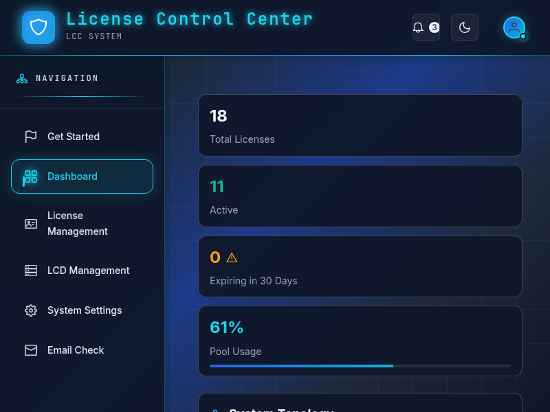

# LCC Server - Next Generation License Control Center



LCC Server is a revolutionary **License Control Center** designed for **Enterprise**, **Internet**, and **AIGC** environments. It represents a new generation of license management systems with unparalleled features that set it apart from traditional solutions.

## 🌟 Key Features & Advantages

### 1. Zero Intrusion to Applications
Unlike traditional license systems that require extensive code modifications, LCC achieves near-zero intrusion to existing applications. Traditional systems often require significant code changes, but LCC minimizes this through advanced compilation techniques.

### 2. Configuration-Driven Approach
LCC leverages compiler technology to generate all necessary components from simple configuration files. Users only need to define what they want, without any cognitive burden of implementation details.

### 3. AI-Powered Configuration Generation
With the rise of AI capabilities, LCC can generate complete configurations from simple prompts, enabling rapid deployment and setup through generative technologies.

### 4. Offline & Online Hybrid Support
LCC is specifically designed for enterprise environments with limited or no internet connectivity. It seamlessly combines offline processing capabilities with online services for maximum flexibility.

### 5. Internet Subscription Ready
Built for modern SaaS environments, LCC provides robust support for subscription-based licensing models, making it ideal for internet-scale deployments.

### 6. Hardware Decoupling with LCD Technology
LCC introduces the innovative **LCD (License Control Dog)** technology that decouples license management from hardware constraints, providing both flexible control and high availability.

## 🖼️ LCC Server Interface

The screenshot above shows the actual LCC Server interface running at `https://localhost:8088/`. The interface provides comprehensive license management capabilities including:

- Real-time license monitoring and usage tracking
- Multi-tenant license management
- Flexible license policy configuration
- Detailed analytics and reporting
- User and permission management
- API access control

## 🏗️ Architecture Overview

```
┌─────────────────┐    ┌─────────────────┐    ┌─────────────────┐
│   Application   │    │   Application   │    │   Application   │
│     Client      │    │     Client      │    │     Client      │
└─────────┬───────┘    └─────────┬───────┘    └─────────┬───────┘
          │                      │                      │
          └──────────────────────┼──────────────────────┘
                                 │
                      ┌─────────▼─────────┐
                      │   LCC Server      │
                      │                   │
                      │  License Manager  │
                      │  Database Layer   │
                      │  API Interface    │
                      └─────────┬─────────┘
                                │
                     ┌──────────▼──────────┐
                     │   Administration    │
                     │       Portal        │
                     └─────────────────────┘
```

## 🚀 Getting Started with LCC SDK

LCC provides a powerful SDK for seamless integration with your applications:

### Quick Integration Steps

1. **Define Features in YAML**:
```yaml
# lcc-features.yaml
sdk:
  lcc_url: "https://localhost:8088"
  product_id: "my-enterprise-app"
  product_version: "1.0.0"

features:
  - id: advanced_analytics
    name: "Advanced Analytics"
    intercept:
      package: "myapp/analytics"
      function: "AdvancedAnalytics"
    fallback:
      package: "myapp/analytics"
      function: "BasicAnalytics"
```

2. **Generate Wrappers Automatically**:
```bash
go generate ./...
```

3. **Initialize SDK Transparently**:
```go
package main

import (
    _ "github.com/yourorg/lcc-sdk/auto"
)

func main() {
    // Your existing code - SDK works transparently
    result := analytics.AdvancedAnalytics(data)
}
```

## 🛠️ Deployment Options

### Prerequisites
- Docker (for containerized deployment)
- Or supported OS (Linux, Windows, macOS) with required dependencies

### Installation

1. Clone the repository:
   ```bash
   git clone git@github.com:dataxcash/lcc_server.git
   ```

2. Navigate to the release directory for your platform:
   ```bash
   cd release/v1.0/[platform]/amd64
   ```

3. Build the Docker image:
   ```bash
   docker build -t lcc-server .
   ```

4. Run the container:
   ```bash
   docker run -p 8088:8088 lcc-server
   ```

## 📚 Documentation & Resources

- [LCC SDK Documentation](../lcc-sdk/README.md) - Complete guide to integrating LCC with your applications
- [Demo Application](../lcc-demo-app/README.md) - Working example showcasing LCC capabilities
- [Configuration Reference](docs/configuration.md) - Detailed configuration options
- [API Documentation](docs/api.md) - REST API reference for custom integrations

## 🤝 Contributing

We welcome contributions from the community! Please see our [contributing guidelines](CONTRIBUTING.md) for details on how to submit patches and features.

## 📄 License

This project is licensed under the MIT License - see the [LICENSE](LICENSE) file for details.

## 🆘 Support

For support, please open an issue on our GitHub repository or contact our team at support@lccserver.com.